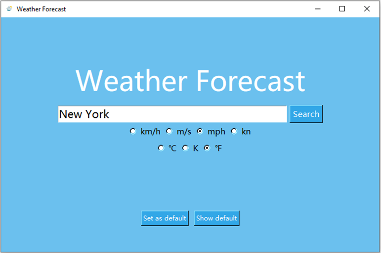
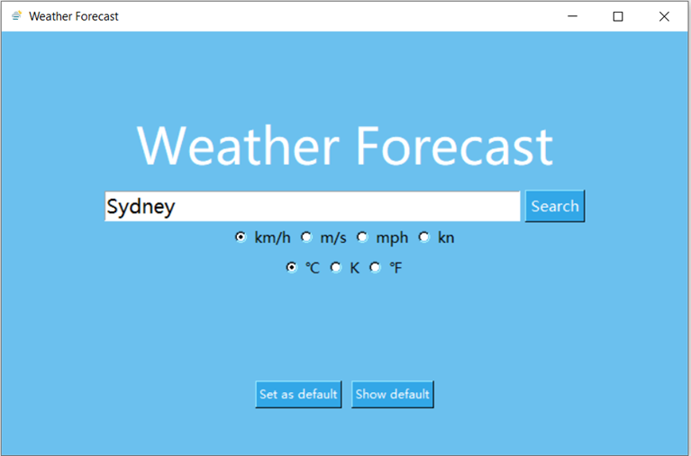
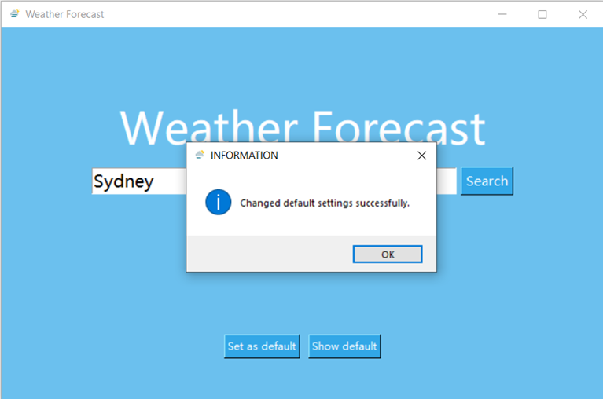
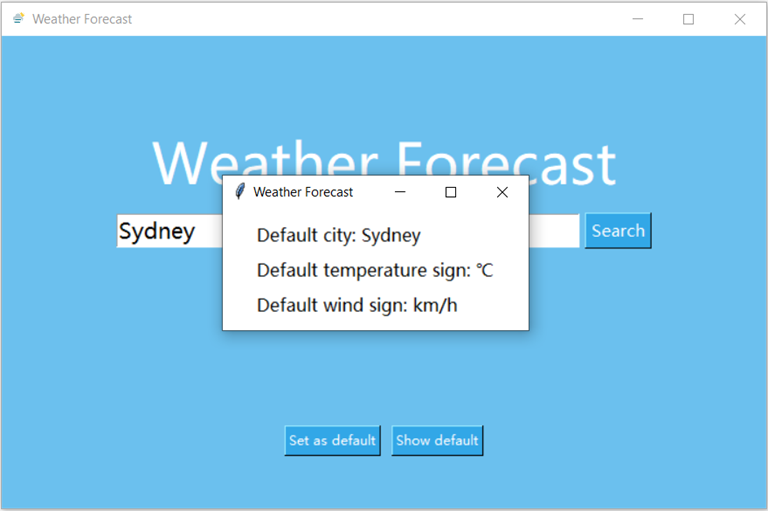
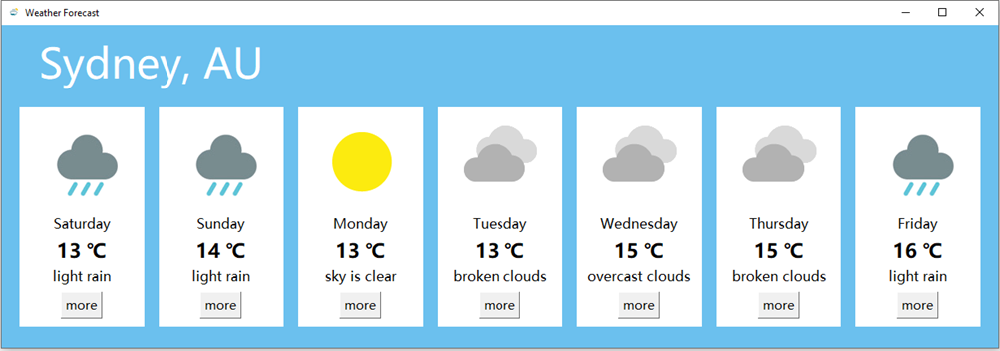
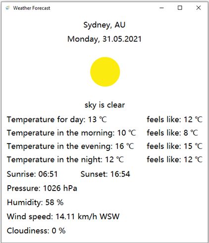
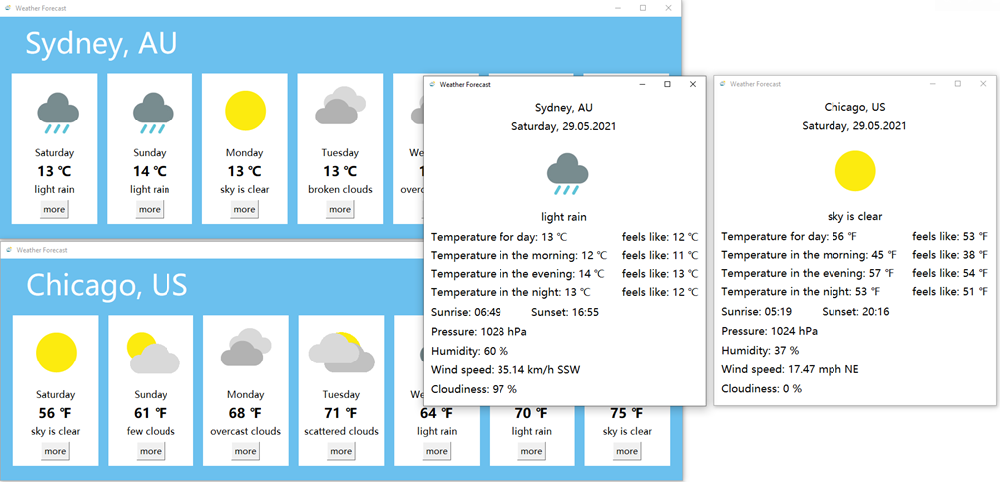

# Weather App
Weather desktop application built using Python. This app shows weather forecast for 7 days.

## Table of contents
* [Features](#features)
* [Technologies and sources](#technologies-and-sources)
* [Installation and setup](#installation-and-setup)
* [View](#view)

## Features
* Display general weather forecast for given city
* Display details about weather for chosen day
* Choose temperature unit (°C, °F and K)
* Choose wind speed unit (km/h, m/s, mph and knots)
* Save default values (city name, temperature unit and speed unit)
* Display default values (city name, temperature unit and speed unit)
* Load default values (city name, temperature unit and speed unit) when launching the app
* Display weather forecast for different cities with changed temperature and wind speed units at the same time

## Technologies and sources
* Python version: 3.8
* Used API - weather forecast: https://openweathermap.org/forecast16
* Used icons: https://www.weatherbit.io/api/codes

## Installation and setup
In order to use the application create 'api_key.py' file in 'utils' package. Then create 'PRIVATE_API_KEY' variable in it which will store your private api key. 
This app uses Daily Forecast 16 days, so make sure that your key can give you access to this collection.

Content of: Weather-App/app/utils/api_key.py file
```python
PRIVATE_API_KEY = 'your_api_key'
```

Use the package manager [pip](https://pip.pypa.io/en/stable/) to install all essential libraries.

```bash
pip install datetime
pip install Pillow
pip install requests
```
## View
### Main window


### Saving default values

After clicking 'Set as default' button


### Display default values
After clicking 'Show default' button


### Display weather forecast for given city

After clicking 'Search' button

After clicking 'more' button for chosen day


### Display weather forecast for two cities

